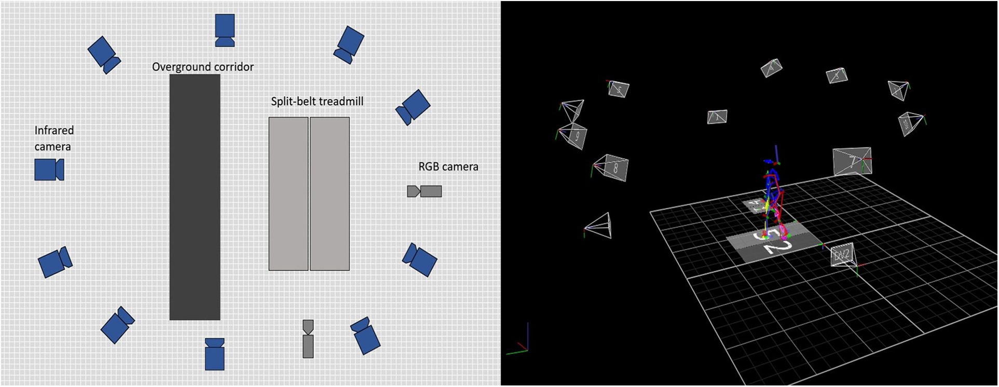

# 📚 Paper Translation & Insights Dashboard

田中様の研究プロジェクト（MediaPipeの外れ値・Jump除去、姿勢推定の精度向上）に関連する最新論文の翻訳とインサイトをまとめたダッシュボードです。
気になる論文のタイトル（▶︎）をクリックして展開し、詳細を確認してください。

---

<b>▶︎ 1. 拡張時系列畳み込みと半教師あり学習を用いたビデオにおける3D人体姿勢推定</b>

### 3D human pose estimation in video with temporal convolutions and semi-supervised training

> [!NOTE]
> **💡 一言でいうと？**
> 1Dの「拡張時間畳み込み」を使って、動画から計算効率よく超高精度な3D姿勢を推定するモデル！ラベルなし動画を使った半教師あり学習（逆投影）も提案。

- 🎯 **研究への応用ヒント**: MediaPipeの出力に対して、単純なローパスフィルタではなく「1D CNNフィルター」を後処理にかけることで、一時的なJumpノイズを前後の文脈から自然に修復・平滑化できます。
- 👉 **[📖 詳細ノートを読む (全文翻訳あり)](paper_notes/1811.11742v2.md)**

 

<b>▶︎ 2. 疎なIMUを用いた物理情報学習に基づく全身運動キネマティクス予測</b>

### Physics-Informed Learning for Human Whole-Body Kinematics Prediction via Sparse IMUs

> [!NOTE]
> **💡 一言でいうと？**
> たった5個のIMUセンサーと「物理法則（運動学）」を組み合わせて、ドリフトや破綻のない滑らかな全身3Dモーションを予測する超軽量モデル（PINKP）！

- 🎯 **研究への応用ヒント**: MediaPipeがJumpを起こす際の「あり得ない骨の長さ」や「関節の曲がり方」を防ぐため、FK（順運動学）の物理制約をロス関数や後処理オプティマイザに組み込むアプローチが有効です。
- 👉 **[📖 詳細ノートを読む (全文翻訳あり)](paper_notes/2509.25704v1.md)**

 

<b>▶︎ 3. 姿勢評価のためのMediaPipe Poseの徹底分析：比較調査</b>

### A Deep Dive into MediaPipe Pose for Postural Assessment: A Comparative Investigation

> [!WARNING]
> **💡 一言でいうと？**
> 「MediaPipeの3Dモデルは複雑度(Complexity)を上げるほど歪む！」という直感に反する重大なバグ的挙動を発見し、臨床利用への警告と最適な使い方をガイドした重要論文。

- 🎯 **研究への応用ヒント**: 田中様が観測しているOutlierの多くはMediaPipe内部の「3D推論ネットワーク（Uplift）の不安定さ」に起因している可能性大！ `model_complexity=0` または `1` に下げるだけでJumpが激減するかテストする価値があります。
- 👉 **[📖 詳細ノートを読む (全文翻訳あり)](paper_notes/A_Deep_Dive_into_MediaPipe_Pose_for_Postural_Asses.md)**

 

<b>▶︎ 4. 一般化可能な人体姿勢推定のための自己修正可能および適応型推論</b>

### Self-Correctable and Adaptable Inference for Generalizable Human Pose Estimation

> [!NOTE]
> **💡 一言でいうと？**
> テスト時に「正解データ」がなくても、モデルが自分で予測の「ズレ」を評価し、その場で姿勢のミス（手首や足首など）を自己修正する画期的な推論フレームワーク（SCAI）。

- 🎯 **研究への応用ヒント**: 推定した座標周辺の画像特徴と、過去のフレームの特徴を比較するモジュール（FFN）を追加すれば、正解データなしに「真のOutlier」を正確に弾けます。
- 👉 **[📖 詳細ノートを読む (全文翻訳あり)](paper_notes/Kan_Self-Correctable_and_Adaptable_Inference_for_Generalizable_Human_Pose_Estimation_CVPR_2023_paper.md)**

 

<b>▶︎ 5. LSTM Pose Machines（動画向け時間・空間統合型姿勢推定）</b>

### LSTM Pose Machines

> [!NOTE]
> **💡 一言でいうと？**
> 動画の姿勢推定において、オクルージョン（隠れ）やモーションブラー（ブレ）で手足が吹っ飛ぶ「Jump問題」を、LSTMの記憶能力で根本から解決するネットワーク構造！

- 🎯 **研究への応用ヒント**: オクルージョン発生時（座標が急に跳ね上がった時）を検知し、その区間だけ「LSTMが予測した過去の軌跡からの推論値」で置き換えるハイブリッドな後処理が強力です。
- 👉 **[📖 詳細ノートを読む (全文翻訳あり)](paper_notes/Luo_LSTM_Pose_Machines_CVPR_2018_paper.md)**

<b>▶︎ 6. 下半身キネマティクスにおける姿勢推定モデルの比較：検証研究</b>

### Comparison of different pose estimation models for lower-body kinematics: A validation study

> [!NOTE]
> **💡 一言でいうと？**
> MediaPipeやYOLOなど6つの姿勢推定モデルをVICON（光学式）と徹底比較！ジョギングなどの動的タスクにおいて、MediaPipeはYOLOやMoveNetよりも有意に膝角度の推定精度が高い（エラーが少ない）ことが証明された論文。

- 🎯 **研究への応用ヒント**: MediaPipeは歩行や走行時の膝角度などで他の軽量モデルより優れており、モデル選定の強い根拠になります。また動的タスクでの誤差傾向を掴むことで、外れ値除去アルゴリズムの「閾値調整」の参考にできます。
- 👉 **[📖 詳細ノートを読む (全文翻訳あり)](paper_notes/SJSP_Vol5_Issue2_Art337.md)**

 

<b>▶︎ 7. 歩行分析における手動マーキング、2D姿勢推定、3Dマーカーシステムの比較</b>

### Gait analysis comparison between manual marking, 2D pose estimation algorithms, and 3D marker-based system

> [!NOTE]
> **💡 一言でいうと？**
> 高齢者のトレッドミル歩行において、MediaPipeとOpenPoseをViconや手動アノテーション（Kinovea）と比較！全体的な動きの追跡は優秀だが、「足首」のような微小で重要な関節のトラッキングにはAIが苦戦することが判明。

- 🎯 **研究への応用ヒント**: MediaPipeは足首のトラッキングに弱点があるため、足首専用の緩めの平滑化フィルタや、物理制約を強めにかけるアプローチが非常に効果的です。
- 👉 **[📖 詳細ノートを読む (全文翻訳あり)](paper_notes/fresc-04-1238134.md)**

 

<b>▶︎ 8. パーキンソン病患者におけるヒト姿勢推定を用いた歩行パラメータの評価：正面と側面の視点の比較</b>

### Assessment of temporospatial and kinematic gait parameters using human pose estimation in patients with Parkinson’s disease: A comparison between near-frontal and lateral views

> [!WARNING]
> **💡 一言でいうと？**
> MediaPipeの精度は「カメラの撮影角度」で大きく変わる！パーキンソン病の歩行分析において、時間的パラメータには「正面」、歩幅や関節角度には「側面」からの撮影が最適であることを証明した論文。

- 🎯 **研究への応用ヒント**: 側面からの映像では関節角度の精度が高いが、正面からの映像では奥行き（Z軸）の推論エラーにより3D座標のJumpが発生しやすい可能性があります。撮影角度によるノイズ特性の違いをアルゴリズムに組み込めます。
- 👉 **[📖 詳細ノートを読む (全文翻訳あり)](paper_notes/journal.pone.0317933.md)**

