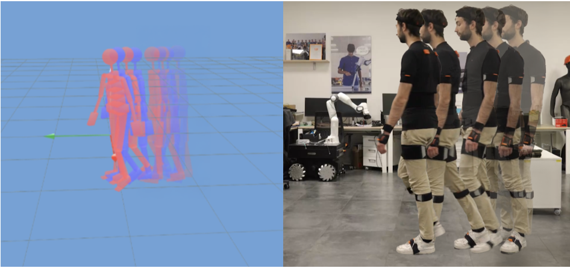
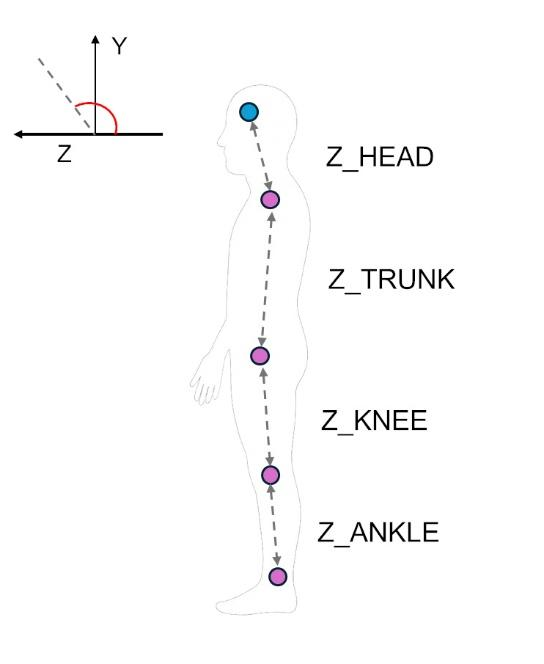
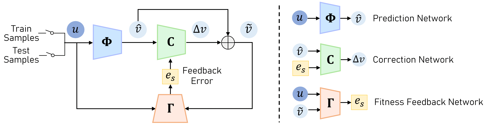
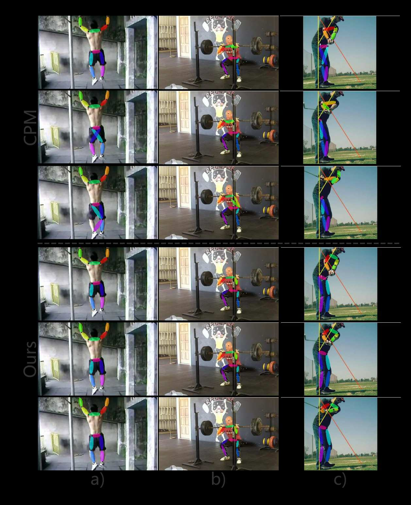

# 📚 Paper Translation & Insights Dashboard

田中様の研究プロジェクト（MediaPipeの外れ値・Jump除去、姿勢推定の精度向上）に関連する最新論文の翻訳とインサイトをまとめたダッシュボードです。各論文の詳細な翻訳や実験結果を見たい場合は、それぞれの**「📖 詳細ノートを読む」**をクリックしてください。

---

## 1. 拡張時系列畳み込みと半教師あり学習を用いたビデオにおける3D人体姿勢推定
### 3D human pose estimation in video with temporal convolutions and semi-supervised training

> [!NOTE]
> **💡 一言でいうと？**
> 1Dの「拡張時間畳み込み」を使って、動画から計算効率よく超高精度な3D姿勢を推定するモデル！ラベルなし動画を使った半教師あり学習（逆投影）も提案。

- 🎯 **研究への応用ヒント**: MediaPipeの出力に対して、単純なローパスフィルタではなく「1D CNNフィルター」を後処理にかけることで、一時的なJumpノイズを前後の文脈から自然に修復・平滑化できます。
- 👉 **[📖 詳細ノートを読む (全文翻訳あり)](paper_notes/1811.11742v2.md)**

---

## 2. 疎なIMUを用いた物理情報学習に基づく全身運動キネマティクス予測
### Physics-Informed Learning for Human Whole-Body Kinematics Prediction via Sparse IMUs

> [!NOTE]
> **💡 一言でいうと？**
> たった5個のIMUセンサーと「物理法則（運動学）」を組み合わせて、ドリフトや破綻のない滑らかな全身3Dモーションを予測する超軽量モデル（PINKP）！

- 🎯 **研究への応用ヒント**: MediaPipeがJumpを起こす際の「あり得ない骨の長さ」や「関節の曲がり方」を防ぐため、FK（順運動学）の物理制約をロス関数や後処理オプティマイザに組み込むアプローチが有効です。
- 👉 **[📖 詳細ノートを読む (全文翻訳あり)](paper_notes/2509.25704v1.md)**

---

## 3. 姿勢評価のためのMediaPipe Poseの徹底分析：比較調査
### A Deep Dive into MediaPipe Pose for Postural Assessment: A Comparative Investigation

> [!WARNING]
> **💡 一言でいうと？**
> 「MediaPipeの3Dモデルは複雑度(Complexity)を上げるほど歪む！」という直感に反する重大なバグ的挙動を発見し、臨床利用への警告と最適な使い方をガイドした重要論文。

- 🎯 **研究への応用ヒント**: 田中様が観測しているOutlierの多くはMediaPipe内部の「3D推論ネットワーク（Uplift）の不安定さ」に起因している可能性大！ `model_complexity=0` または `1` に下げるだけでJumpが激減するかテストする価値があります。
- 👉 **[📖 詳細ノートを読む (全文翻訳あり)](paper_notes/A_Deep_Dive_into_MediaPipe_Pose_for_Postural_Asses.md)**

---

## 4. 一般化可能な人体姿勢推定のための自己修正可能および適応型推論
### Self-Correctable and Adaptable Inference for Generalizable Human Pose Estimation

> [!NOTE]
> **💡 一言でいうと？**
> テスト時に「正解データ」がなくても、モデルが自分で予測の「ズレ」を評価し、その場で姿勢のミス（手首や足首など）を自己修正する画期的な推論フレームワーク（SCAI）。

- 🎯 **研究への応用ヒント**: 推定した座標周辺の画像特徴と、過去のフレームの特徴を比較するモジュール（FFN）を追加すれば、正解データなしに「真のOutlier」を正確に弾けます。
- 👉 **[📖 詳細ノートを読む (全文翻訳あり)](paper_notes/Kan_Self-Correctable_and_Adaptable_Inference_for_Generalizable_Human_Pose_Estimation_CVPR_2023_paper.md)**

---

## 5. LSTM Pose Machines（動画向け時間・空間統合型姿勢推定）
### LSTM Pose Machines

> [!NOTE]
> **💡 一言でいうと？**
> 動画の姿勢推定において、オクルージョン（隠れ）やモーションブラー（ブレ）で手足が吹っ飛ぶ「Jump問題」を、LSTMの記憶能力で根本から解決するネットワーク構造！

- 🎯 **研究への応用ヒント**: オクルージョン発生時（座標が急に跳ね上がった時）を検知し、その区間だけ「LSTMが予測した過去の軌跡からの推論値」で置き換えるハイブリッドな後処理が強力です。
- 👉 **[📖 詳細ノートを読む (全文翻訳あり)](paper_notes/Luo_LSTM_Pose_Machines_CVPR_2018_paper.md)**

