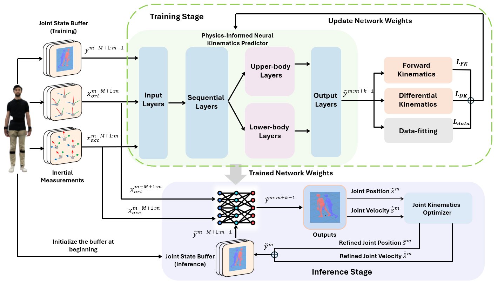
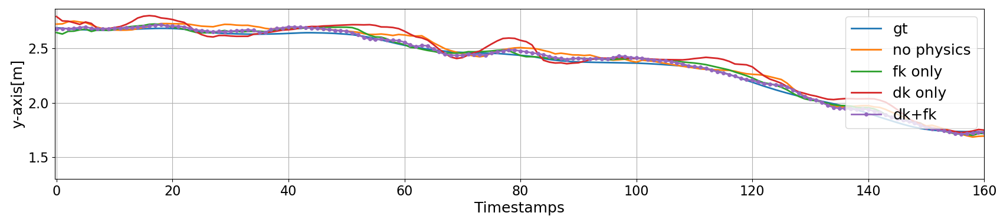
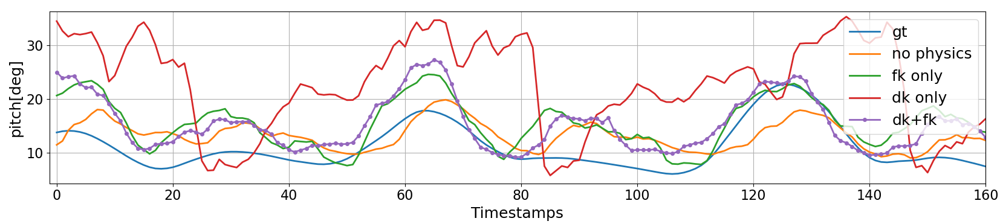
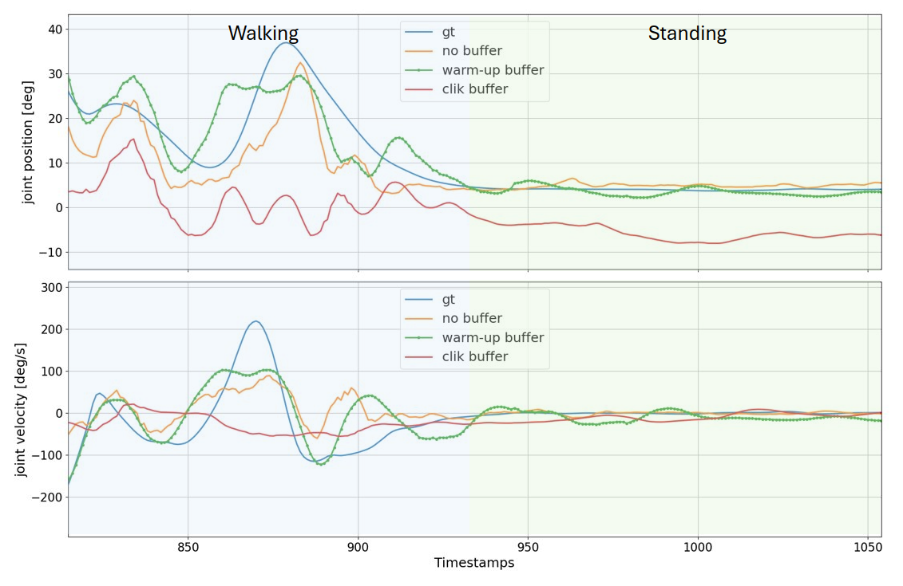
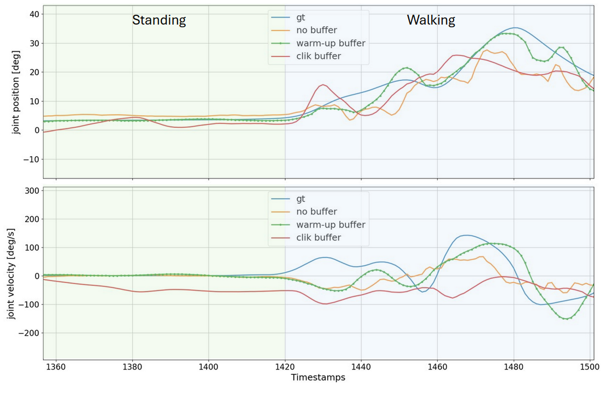
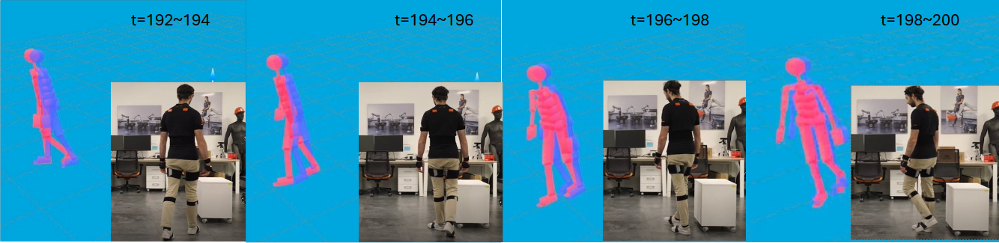
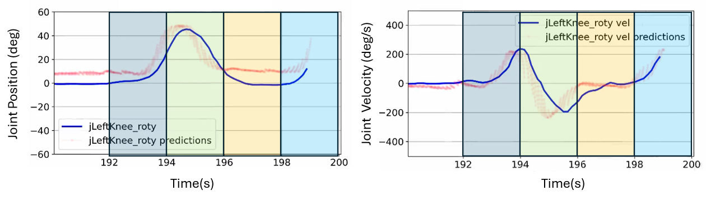

# 疎なIMUを用いた物理情報学習に基づく全身運動キネマティクス予測
### Physics-Informed Learning for Human Whole-Body Kinematics Prediction via Sparse IMUs

> [!NOTE]
> **💡 一言でいうと？**
> たった5個のIMUセンサーと「物理法則（運動学）」を組み合わせて、ドリフトや破綻のない滑らかな全身3Dモーションを予測する超軽量モデル（PINKP）！

## 🚀 主な貢献と新規性

- 📌 **物理情報学習 (Physics-Informed Learning)**: ニューラルネットの損失関数に「順運動学（FK）」と「微分運動学（DK）」の物理ルールを組み込み、関節が外れたり骨が伸び縮みするエラーを撲滅！
- 📌 **わずか5つのIMUで全身推定**: 17個もセンサーを付ける既存の商用システムと違い、たった5つで高精度な推定を実現。
- 📌 **超低遅延（1ms未満）**: スマホ等のエッジデバイスでも余裕でリアルタイム動作可能な軽さ。

---

## 💡 研究への応用・インサイト

> [!TIP]
> **🎯 物理制約（Kinematics）を利用したMediaPipe補正のヒント**

### 1. 物理制約（骨の長さ・関節可動域）のLossへの組み込み
MediaPipeが3D空間でJumpを起こす際、しばしば「あり得ない骨の長さ」や「関節の曲がり方」になります。本論文のように、**FK（順運動学）の制約をロス関数や後処理のオプティマイザに組み込む**ことで、物理的に破綻したOutlierを強力に防げます。

### 2. 過去の状態バッファによる自己回帰補正
単一フレームのMediaPipeの代わりに、過去 $M$ フレームの推定状態をバッファとして持ち、それを基に現在フレームを「リファイン（微修正）」する機構を入れることで、時間的なドリフトやJumpを滑らかにできます。

---

📄 全文翻訳（詳細）

# 疎なIMUを用いた物理情報学習に基づく全身運動キネマティクス予測
# Physics-Informed Learning for Human Whole-Body Kinematics Prediction via Sparse IMUs (ArXiv 2025)

## 著者情報
- **Cheng Guo¹˒²**, **Giuseppe L’Erario¹˒²**, **Giulio Romualdi¹**, **Mattia Leonori³**, **Marta Lorenzini³**, **Arash Ajoudani³**, **Daniele Pucci¹˒²**
- ¹ 独立行政法人 イタリア技術研究所（IIT）人工機械知能研究ユニット (Artificial and Mechanical Intelligence, Istituto Italiano di Tecnologia, Genoa, Italy)
- ² マンチェスター大学 コンピュータサイエンス学科 (Department of Computer Science, The University of Manchester, Manchester, UK)
- ³ イタリア技術研究所（IIT）人間ロボットインターフェース・インタラクション研究ユニット (Human-Robot Interfaces and Interaction, Istituto Italiano di Tecnologia, Genoa, Italy)

---

## 概要

 (Abstract)

安全でシームレスな人間とロボットの協調（Human-Robot Collaboration: HRC）を実現するためには、正確で物理的に実行可能（Physically Feasible）な人間の動作予測が極めて重要です。

近年、人間のモーションキャプチャ技術はリアルタイム姿勢推定を可能にしましたが、既存アプローチの多くは「未来予測」を欠いていること、また「物理的制約」を考慮していないことから、実際の適用シーンでの有用性が制限されていました。

また、従来の動作予測スキームは過去の完全な関節姿勢に大きく依存していますが、実世界のシナリオではこれらが常に得られるとは限りません。

これらの課題に対処するため、本論文では、わずか**5個のIMU（慣性計測装置）**からの慣性測定値を用いて、ドメイン知識（物理法則）を訓練と推論の両方に統合する**物理情報学習（Physics-Informed Learning）フレームワーク**を提案します。
本手法では、人間の動作の空間的特徴を捉えるネットワークを提案します。

学習（Training）段階では、順運動学（Forward Kinematics: FK）および微分運動学（Differential Kinematics: DK）関数を補助的な損失関数（Loss Components）として組み込むことで、学習された関節予測値を正則化します。

推論（Inference）段階では、前回の予測値を用いて**関節状態バッファ（Joint State Buffer）**を再帰的に更新し、それを追加の入力として用いることで、動きの滑らかな遷移（Smooth Transitions）を可能にします。
実験の結果、提案手法（PINKP: Physics-Informed Neural Kinematics Predictor）は高精度かつ滑らかな動作遷移を達成し、未学習の被験者に対しても高い汎化性能を示すことを実証しました。

---

## 1. はじめに (Introduction)

人間とロボットの協調（HRC）において、ロボットが安全に作業をサポートするためには、人間の意図や未来の動きを予測する能力が必要です。

光学式のモーションキャプチャは高精度ですが、カメラの視野角（オクルージョン）や照明環境に大きく依存し、活動範囲が狭いという欠点があります。

これに対し、ウェアラブルな慣性センサー（IMU）を用いた手法は頑健ですが、商用の高精度システムは17個以上の大量のIMUを全身に装着する必要があり、装着の手間や作業時の不快感から、産業現場での実用性に欠けます。

近年、少数のIMU（例：5〜6個）から全身ポーズを復元する研究が行われていますが、蓄積する「長期的なドリフト」や「関節角度の不整合（曖昧さ）」の解決、および「未来の動きの予測」は未解決のままでした。

さらに、人間の関節を多関節リンクとして捉える際、既存アプローチの多くは関節角度ではなく、タスク空間（リンクの位置・姿勢）で関節位置を回帰しており、物理的（機構的）な関節可動域や結合関係の制約が無視され、不自然なスケール崩れや骨が伸び縮みするなどの問題が生じていました。

これらの制限を克服するため、ロボティクスの標準表現である **URDF（Unified Robot Description Format）** を用いて人間を多関節剛体システムとして定義し、その構成空間（Configuration Space: $Q$）で運動モデル化を行います。

そして、ディープラーニングモデルに**順運動学（FK）および微分運動学（DK）**を組み込んだ、PINKP（Physics-Informed Neural Kinematics Predictor）を構築しました。

---

## 2. 提案手法 (Proposed Method)

### 2.1. 人間のキネマティクスモデリング (Human Kinematics Modeling)
人間を、浮遊基地（Floating-base）をもつ $n+1$ 個のリンクと $n$ 個の関節からなる多関節剛体システムとして定義します。
- システムの構成（状態）: $q = (p_B, R_B, s) \in Q$
  - $p_B, R_B$: ベースフレーム $B$（骨盤）の3D位置および回転行列
  - $s \in \mathbb{R}^n$: 関節の角度（位置）
- システムの速度: $\nu = (\dot{p}_B, \omega_B, \dot{s}) \in \mathcal{V}$
  - $\dot{s} \in \mathbb{R}^n$: 関節の角速度（速度）

順運動学（FK）は関節構成 $q$ から各リンク $i$ の位置・回転 $H_i \in SE(3)$ へのマッピングを表し、微分運動学（DK）はヤコビアン $J_i(q)$ を用いて速度の関係 $\nu \to v_i$ を定義します。

### 2.2. 問題定義 (Problem Formulation)
骨盤（Pelvis）、両前腕（Forearms）、両下腿（Lower legs）に装着された**5個のIMU**から、過去 $M$ ステップの加速度および回転行列の時系列データ $X_{m-M+1:m}$ を取得します。
目的は、未来の $K$ ステップ先までの全身関節角度および関節速度 $\tilde{y}_{m:m+K-1} = [\tilde{s}, \tilde{\dot{s}}]$ を連続的に予測することです。

### 2.3. PINKPのネットワーク構造と損失設計

1. **関節状態バッファ（Joint State Buffer）**:
   疎なIMUから生じるポーズの曖昧さ（例：IMU測定値が似ているが異なるポーズ）を解決するため、過去 $M-1$ ステップの推定関節状態（履歴）をバッファとして保持し、センサーデータと合わせてネットワークに同時に入力します。

推論時は、前回の予測ステップをバッファにフィードバックする FIFO（先入れ先出し）構造で自己回帰的に予測を行います。
2. **ネットワーク設計**:
   IMUデータと関節バッファデータは全結合層（ELU活性化）で特徴抽出されたのち結合されます。

人間の上半身と下半身の動きは大部分が独立しているため、上半身用と下半身用の**2つの並列ブロック**を構成し、最終段で統合して全身の協調動作を出力します。
3. **物理情報損失関数（Physics-Informed Loss）**:
   予測値 $\tilde{s}, \tilde{\dot{s}}$ が、データ正解値と一致するための「データ適合損失」に加え、物理モデルに基づき各リンクの位置・姿勢・速度がURDFから定義される順運動学（FK）および微分運動学（DK）の数式に一致するように、誤差項を損失関数に加えます。

$$L_{\text{total}} = \lambda_1 L_{\text{pos}} + \lambda_2 L_{\text{vel}} + \lambda_3 L_{\text{FK}} + \lambda_4 L_{\text{DK}}$$

### 2.4. 関節キネマティクスオプティマイザ (Joint Kinematics Optimizer)
推論（Inference）の実行時、センサーのノイズや長期的ドリフトによる予測の歪みが蓄積するのを防ぐため、現在ステップ $m$ におけるネットワークの初手予測を、微分運動学（DK）制約を満たすよう勾配ベースの最適化問題としてその場で微修正（リファインメント）し、関節状態バッファを補正して次ステップへ繋ぎます。

これにより、閉ループで安定した長期予測を実現します。

---

## 3.

 実験と評価 (Experiments and Results)

- **自社データセット**: Xsensシステム（17個のIMU）で取得した約1時間の高精度全身関節モーション（60 Hzでサンプリング）から、5つのIMUデータと全身URDF関節角度を抽出し、PINKPの訓練と検証を実施。

様々な歩行（通常、高速、後退、カニ歩き、腕振り歩行等）および立ち座り（Sit-to-stand）の動作を含みます。

### 主要な結果：
1. **予測精度の比較**:
   - 提案モデル（PINKP）は、時系列予測のベンチマークである LSTM、TCN（Temporal Convolutional Network）、および TIP（Temporal Information Processing）と比較して、関節位置誤差（pMAE）および関節速度誤差（vMAE）の双方において一貫して最も低いエラー率を達成しました。
   - 特に未来への予測ステップが長くなるほど、物理制約をもたない他のモデルはドリフトによって骨格構造が破綻しエラーが急増しましたが、PINKPは極めて頑健かつ滑らかな軌跡を維持しました。
2. **リアルタイム性（推論速度）**:
   - 提案手法のネットワーク推論は、1回あたり平均して **1 ms 未満**（CPU / ラップトップ環境）で動作し、スマートフォンなどのエッジデバイス単体でのリアルタイム歩行解析や、オンラインでの即時ロボット制御への適用可能性が非常に高いことを実証しました。
3. **アブレーション研究（Ablation Study）**:
   - 順運動学（FK）および微分運動学（DK）の損失を追加することで、骨格の関節位置ズレやリンク位置・速度の推定エラー（pRMSE, vRMSE）が大幅に抑制されることを実証。
   - 関節キネマティクスオプティマイザの導入により、バッファデータの累積エラー（ドリフト）が防がれ、25秒以上の長時間の自己回帰予測でも動作遷移が滑らかに保たれました。

---

## 4. 結論と展望 (Conclusion and Future Work)

本論文では、わずか5個のIMU情報のみから、全身関節のキネマティクス（位置・速度）を未来予測する物理情報学習フレームワーク（PINKP）を提案しました。
URDFを用いた機構的な物理制約（順運動学、微分運動学）を学習・推論に埋め込むことで、疎なセンサーから生じる予測の不整合や物理的な破綻（ドリフト、カクつき）を本質的に排除しました。

1ms未満という超低遅延動作は、モバイルやスマートフォン単体でのリアルタイムかつエネルギー効率の高い歩行解析、姿勢評価を実装する上で、非常に重要なブレイクスルーとなる技術です。

### その他の図表

