# 姿勢評価のためのMediaPipe Poseの徹底分析：比較調査
### A Deep Dive into MediaPipe Pose for Postural Assessment: A Comparative Investigation

> [!WARNING]
> **💡 一言でいうと？**
> 「MediaPipeの3Dモデルは複雑度(Complexity)を上げるほど歪む！」という直感に反する重大なバグ的挙動を発見し、臨床利用への警告と最適な使い方をガイドした重要論文。

## 🚀 主な貢献と新規性

- 📌 **3D再構成における「複雑度と精度の逆転現象」**: Complexity 2（最高精度）のモデルが、3D空間上で**最も激しく骨格をねじ曲げ、左右非対称な歪みを人工的に作り出す**ことを発見しました。
- 📌 **2Dモデルの卓越した信頼性**: 逆に、MediaPipeの2D（前面投影）モデルは非常に精度が高く、姿勢評価において極めて実用的であることを証明しました。

---

## 💡 研究への応用・インサイト

> [!IMPORTANT]
> **🚨 MediaPipeの「Jump現象」の根本原因に迫る決定的証拠**

### 1. 3D Uplift（2D→3D変換）由来のノイズ分離
田中様が観測しているOutlierやJumpの多くは、画像上の認識エラーではなく、MediaPipe内部の**3D推論ネットワーク（Uplift）の不安定さ**に起因している可能性が高いです！
👉 **アクション**: 分析対象を3D座標から2D画像座標に切り替えるか、初期化時に `model_complexity=0 または 1` に下げるだけで、ノイズ（Jump）が激減する可能性があります。

### 2. 左右非対称性（Symmetry Index）を異常検知に使う
直立姿勢など本来対称な動きにおいて、MediaPipeが非対称な3D座標を出力し始めたら、それを「Outlierの兆候」として検知するロジックが組めます。

---

📄 全文翻訳（詳細）

# 姿勢評価のためのMediaPipe Poseの徹底分析：比較調査
# A Deep Dive into MediaPipe Pose for Postural Assessment: A Comparative Investigation (IEEE Access 2025)

## 著者情報
- **Claudia Ferraris¹**, **Gianluca Amprimo²**, **Serena Cerfoglio³˒⁴**, **Luca Vismara⁵**, **Veronica Cimolin³˒⁴**
- ¹ イタリア国立研究評議会（CNR）電子・情報・電気通信工学研究所 (Institute of Electronic, Computer and Telecommunication Engineering, National Research Council, Turin, Italy)
- ² トリノ理工大学 制御・コンピュータ工学部門 (Department of Control and Computer Engineering, Politecnico di Torino, Turin, Italy)
- ³ ミラノ工科大学 電子・情報・バイオ工学部門 (Department of Electronics, Information and Bioengineering, Politecnico di Milano, Milan, Italy)
- ⁴ IRCCS ピアンカバッロ サン・ジュゼッペ病院 (IRCCS Istituto Auxologico Italiano, San Giuseppe Hospital, Piancavallo, Italy)
- ⁵ トリノ大学 神経科学部門 (Department of Neuroscience, Università degli Studi di Torino, Turin, Italy)

---

## 概要

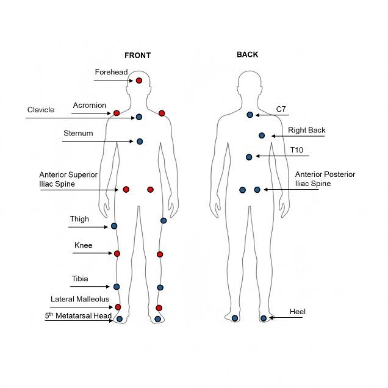

 (Abstract)

マーカーレスの姿勢推定（Markerless Pose Estimation: HPE）は、従来のマーカーベースのシステムに代わるアクセシブルな代替手段として急速に普及しています。

Googleの **MediaPipe Pose (MP)** はRGBカメラ単体（深度情報なし）で動作する有望なソリューションですが、姿勢評価（Postural Assessment）において、その2Dモデルおよび3Dモデルがどの程度の精度や信頼性を有するかについての網羅的な性能調査はこれまで不足していました。

本研究では、異なるネットワーク複雑度（Complexity 0, 1, 2）におけるMediaPipeモデルの測定精度、信頼性、および「左右対称性（Symmetry Preservation）」を系統的に検証しました。

これらを、マーカーベースのゴールドスタンダード（オプトエレクトロニック・モーションキャプチャ：VICON）および、RGB-D（赤外線・深度）カメラベースの基準マーカーレスシステムである **Azure Kinect (AK)** と比較しました。

24名の健康な被験者が40秒間の静的起立姿勢タスクを行い、前面カメラ映像から5つのカテゴリ（水平角度、垂直角度、サジタル角度、関節角度、および身体セグメント長）の姿勢指標を算出しました。

### 主要な発見：
1. **複雑度と3D再構成精度の逆転現象（反直感的劣化）**:
   3DのMediaPipe再構成において、**「モデルの複雑度（Complexity）を上げると、かえって再構成性能が低下する」**という反直感的な劣化現象を発見しました。

最上位の Complexity 2 モデルは、3D空間で激しい歪みと左右の非対称性を導入してしまいます。

この原因は、2Dトラッキングの不具合ではなく、2D座標から3D空間へ持ち上げる「3D-upliftingプロセス（リフティング）」の内部モデル設計に起因していることを証明しました。
2. **2D（2.5D）モデルの卓越した性能**:
   すべての2D（2.5D）MediaPipeモデルは、前面（Frontal Plane）分析（水平・垂直角度測定）において優れた性能を示しました。

一部の特定の関節角度測定に制限はあるものの、高い臨床的実用性を有しています。
3. **RGB-DシステムとRGB-onlyモデルのトレードオフ**:
   本研究は、赤外線深度センサーを用いるRGB-Dシステム（Azure Kinect）の「高精度さ」と、一般的なスマホカメラ等のRGB単体で動くRGB-onlyモデル（MediaPipe）の「手軽さ（アクセシビリティ）」の間の明確なトレードオフを定義しました。

以上の結果に基づき、**「現在の3D MediaPipe Poseモデルは、定量的・臨床的な3D姿勢評価（特に高複雑度モデル）に用いる際は慎重になるべきである。

一方で、2D（2.5D）モデルは、前面（Front View）から行う軽量なスマホアプリ等の用途において、極めて実用的で効果的な選択肢である」**と結論付け、用途に応じた推奨事項を提示します。

---

## 1. はじめに (Introduction)

定量的姿勢評価（Musculoskeletal alignment / balance control）は、高齢者やアスリート、運動器疾患をもつ患者の診断やリハビリテーションにおいて重要です。

従来の反射マーカーを体に貼る光学式モーションキャプチャ（VICONなど）はミリ単位の高精度を誇りますが、設備が数千万円と高価で、広い専門スペース、セットアップのための専門技師、および患者が着替える（半裸にマーカーを貼る）手間など、テレメディスンや日常の簡易測定には不向きです。

これに対し、近年登場したディープラーニングに基づくマーカーレス姿勢推定（HPE）は、一般的なRGBカメラのみで動作するため注目を集めています。

Googleの **MediaPipe Pose** は33個の身体キーポイントをリアルタイムで追跡でき、さらに軽量に最適化されているため、スマートフォンなどでの動作に最適です。
しかし、臨床現場において「MediaPipeを定量的・医療的に使用して、関節角度やアライメントを測定しても、本当に安全で正確なのか？

」という系統的な検証はありませんでした。

---

## 2. 実験方法 (Materials and Methods)

- **被験者**: 健康な成人24名（平均45.69歳）。
- **タスク**: 40秒間の静的起立姿勢（Eyes Open, Relaxed Arms）を4回実施。
- **比較対象システム**:
  1. **VICON (OPTO)**: 6台の赤外線カメラ（100 Hz）。

Plug-In Gaitモデルに準拠した24マーカー（そのうち前面の9マーカーを直接比較に使用）。
  2. **Azure Kinect (AK)**: Azure Kinect Body Tracking SDKを用いて3D骨格を推定。

3Dモデル（KIN_3D）と、深度情報を画像にマッピングした2.5Dモデル（KIN_2D）の2種。
  3. **MediaPipe Pose (MP)**: バージョン v0.10.24。

Complexity 0（高速）、1（バランス）、2（高精度）の3レベル。

それぞれ3Dワールド座標（MP_3D）と、正規化深度をもつ2.5Dモデル（MP_2D）を抽出。

---

## 3.

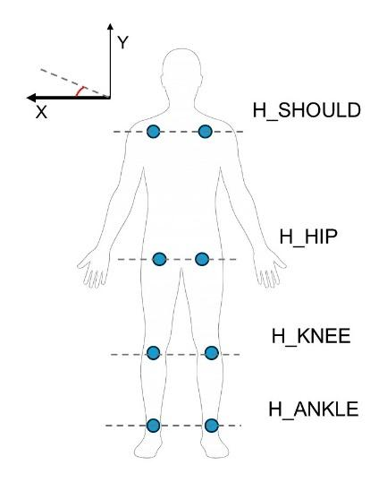

 Postural Parameters（姿勢指標）

抽出された骨格座標（頭部、両肩、両股関節、両膝、両足首）から、MATLABを用いて以下の5カテゴリの指標を計算：
1. **水平角度 (Horizontal Angles)**: 左右の肩（H_SHOULD）、左右の腰（H_HIP）などの前面での傾き（理想値は0°）。
2. **垂直角度 (Vertical Angles)**: 体幹（V_TRUNK）、頭部（V_HEAD）などの横曲がり（側弯）アライメント。
3. **サジタル角度 (Sagittal Angles)**: 横から見た前傾・後傾。

体幹（Z_TRUNK）、頭（Z_HEAD）など（理想値は90°）。
4. **関節角度 (Joint Angles)**: 股関節、膝関節、足首関節の開き角度。
5. **身体セグメント長 (Segment Lengths)**: 肩幅、腰幅、大腿骨長など。

---

## 4. 主要な結果と考察 (Results and Discussion)

1. **2Dモデル（2.5Dモデル）の優秀性**:
   - 前面投影（XY平面）をベースとする「水平角度」や「垂直角度」において、MediaPipeの2Dモデル（MP_0_2D, MP_1_2D, MP_2_2D）は、ゴールドスタンダード（OPTO）およびAzure Kinect（KIN_2D）と極めて高い一致（相関係数 $r \approx 0.85 \sim 0.95$、平均絶対誤差 $< 1.5^\circ$）を示しました。
   - 複雑度（Complexity）による2D推定精度の差はごく僅かであり、最軽量の **Complexity 0 でも十分実用レベルの2Dトラッキングが可能**です。
2. **3D再構成における「モデル複雑度と精度の逆転」の発見（重要）**:
   - サジタル角度（前後方向の奥行き）や、3D関節位置の推定において、最も精度の高いはずの **Complexity 2 モデルが、Complexity 1 や 0 よりも有意に大きな再構成エラーを記録**しました。
   - さらに、Complexity 2 の3D骨格は、**「実際は完全に直立して対称な姿勢をとっている被験者に対し、3D空間上で骨格をねじ曲げ、左右非対称な歪みを人工的に作り出してしまう（Asymmetric Distortion）」** ことが判明しました。
   - このバグのような現象の追究により、原因は「RGB画像からの2D関節検出の失敗」ではなく、「2D座標から3D深度空間に予測値を持ち上げる（Lifting）内部ニューラルネットワークが、Complexity 2 において過学習（Overfitting）または不適切な3Dポーズスペースの制約をかけている」ためであると突き止めました。
3. **セグメント長（身体測定）の限界**:
   - マーカーレスシステム共通の限界として、衣服の影響や、関節の回転中心の定義が仮想的であるため、絶対的な骨の長さ（ミリ単位）を正確に測定するのは依然として困難です。

---

## 5. 結論と実装への知見 (Conclusion & Recommendations)

本論文は、スマートフォンアプリや簡易カメラを用いた運動器スクリーニングを設計する上で、非常に重要な以下のプラクティスを提示しています：

- **3D姿勢評価にMediaPipeを使用する場合は細心の注意が必要**: 奥行き（サジタル面）を含む3D分析を行う場合、MPの3Dモデル（特にComplexity 2）は歪みを生む。

どうしても3D深度が必要な場合は、RGB-Dカメラ（Azure Kinect等）を使うか、MPを使用する場合は Complexity 1 を推奨する。
- **前面アライメント（歩行や姿勢の左右バランス）には 2D モデルが最強**: スマホ単体のフロントビュー（正面撮影）から、歩行バランスや姿勢側弯の測定を行うアプリケーションを構築する場合、**MediaPipeの2Dモデル（特に最軽量の Complexity 0 または 1）は、超高速に動作しながらも、ミリ秒単位でVICONに匹敵する正確な水平・垂直アライメント角度を出力できる**。
- **スマホへの応用**: リアルタイム歩行解析や立ち上がり評価のスマホ実装においては、処理負荷の高いComplexity 2を避け、Complexity 0 もしくは 1 を選択することで、アキュラシー（精度）をほぼ維持したまま圧倒的な軽量動作（高FPS・バッテリー抑制）を実現できる。

### その他の図表
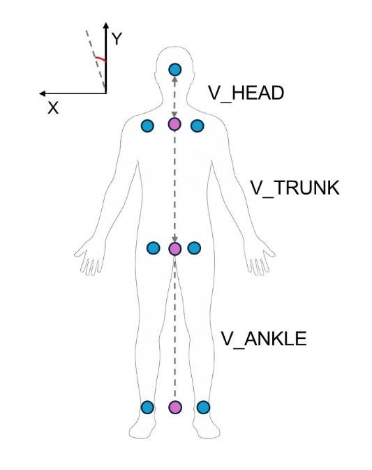

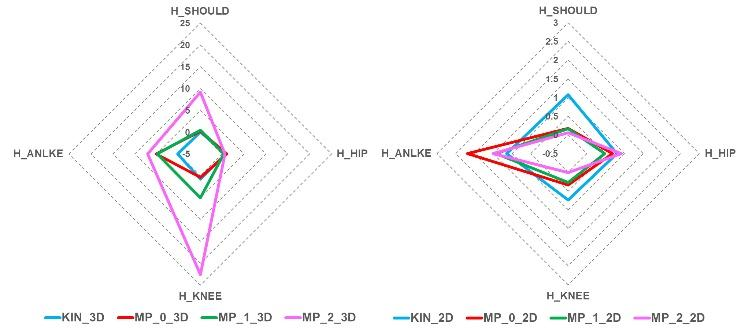

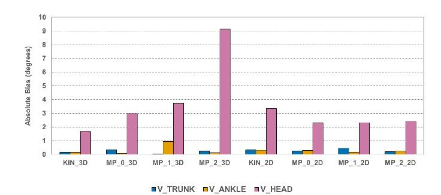

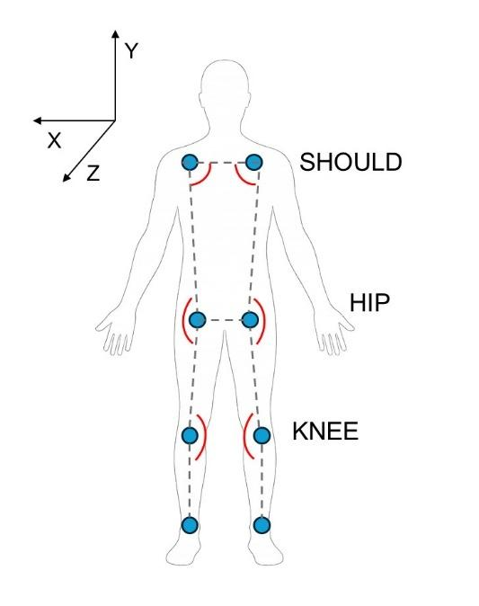

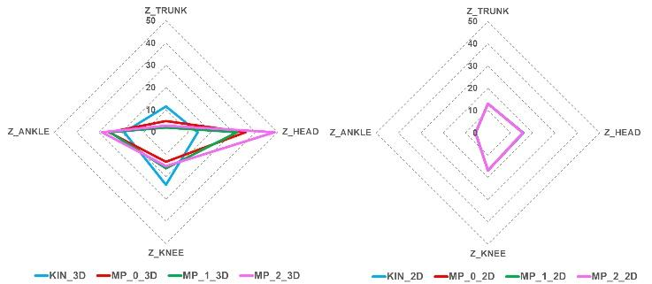

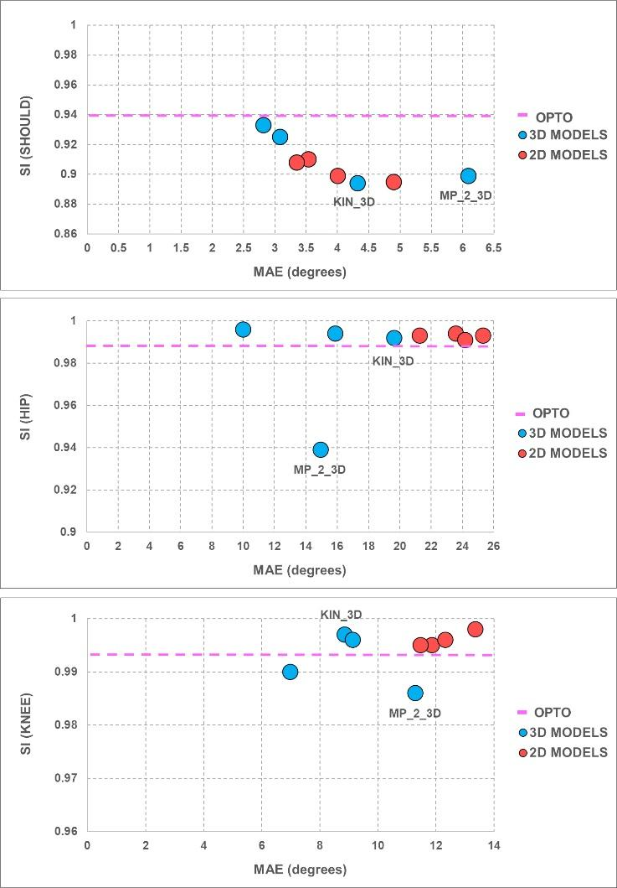

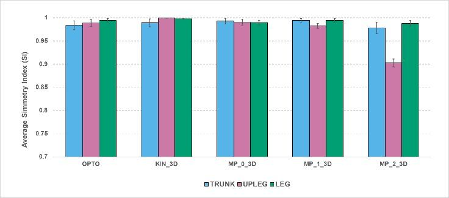

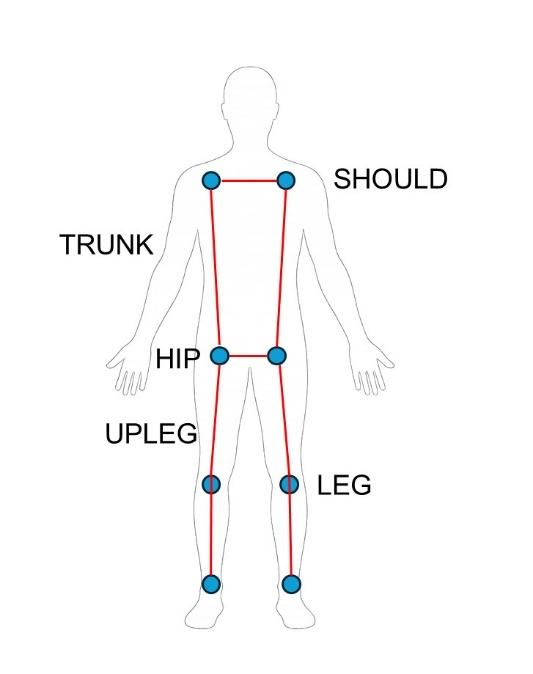

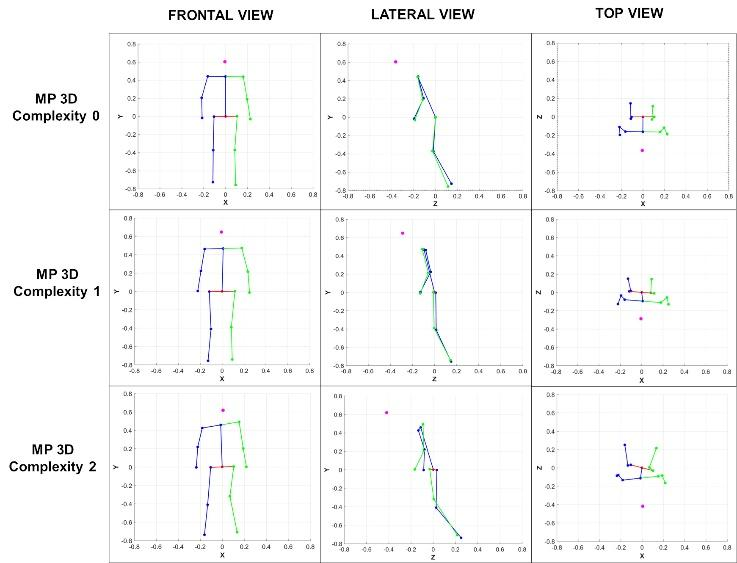

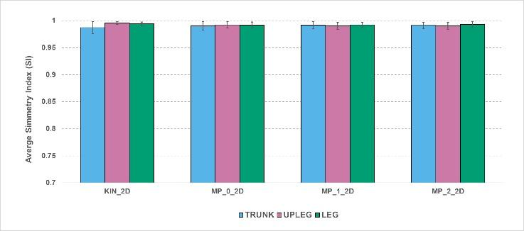

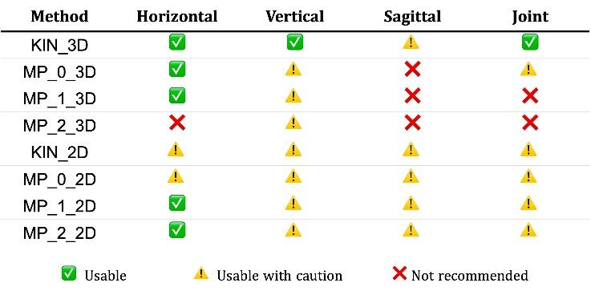

