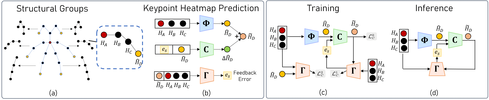
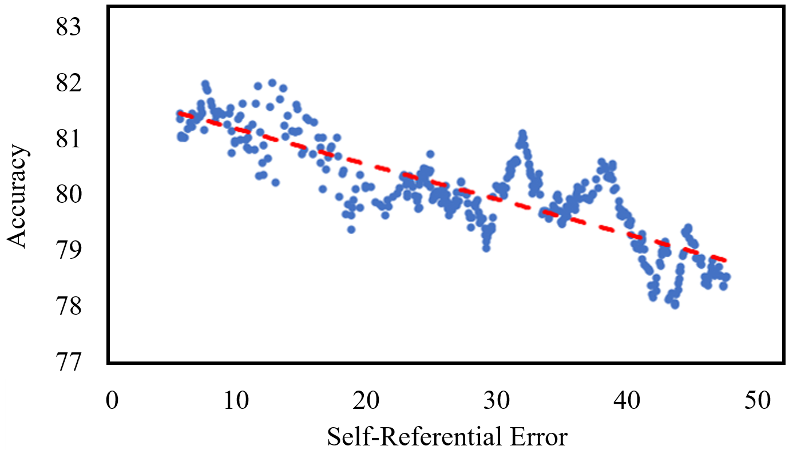
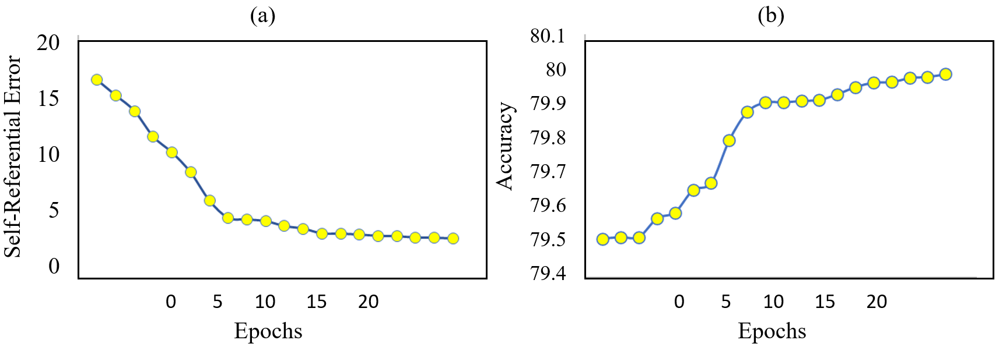
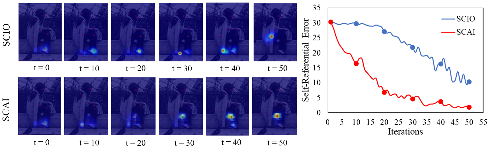
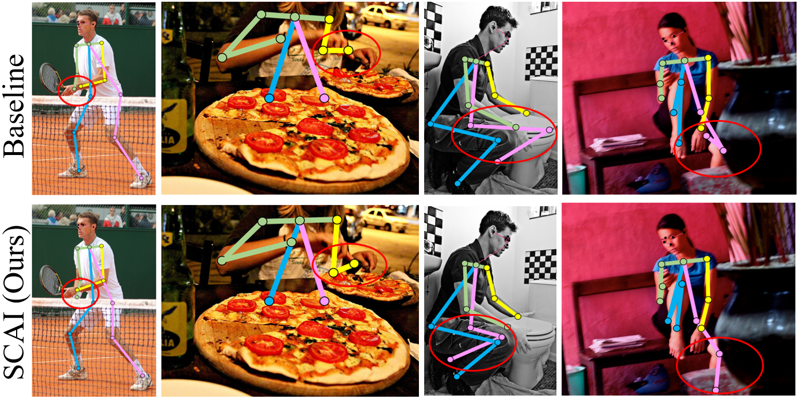
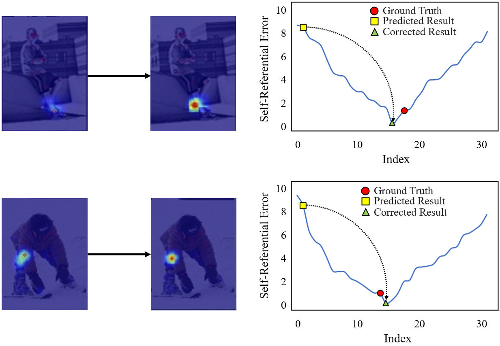

# 一般化可能な人体姿勢推定のための自己修正可能および適応型推論
### Self-Correctable and Adaptable Inference for Generalizable Human Pose Estimation

## 📝 論文概要
本論文（CVPR 2023）は、姿勢推定モデルが「未知のテストデータ（複雑な背景やオクルージョンなど）」に対して精度が落ちてしまう「汎化問題（Generalization problem）」を解決するための新しい推論フレームワーク「SCAI (Self-Correctable and Adaptable Inference)」を提案しています。

### 主な貢献と新規性
1. **自己参照フィードバックエラー（Self-referential feedback error）の導入**: 推論時（テスト時）には正解データ（Ground Truth）が存在しないため、予測が正しいか判断できません。

本研究では、「予測した姿勢（出力）」を「元の入力画像」のドメインに逆マッピングして比較する「Fitness Feedback Network (FFN)」を学習させました。

このFFNが出力する自己参照エラーは、驚くべきことに**実際の予測誤差（Prediction Error）と非常に強い相関（-0.84）を持つ**ことが発見されました。
2. **テスト時の動的な自己修正（Adaptable Inference）**: 事前学習済みの推論ネットワークが出した結果に対し、上記の自己参照エラーをフィードバックとして受け取り、テスト画像ごとに動的に姿勢のズレ（特に手首や足首などのDistal keypoints）を補正（Correction）するネットワークを構築し、State-of-the-Artの精度を達成しました。

---

## 💡 研究への応用・インサイト

### 1. 「Ground Truthなし」でのTrue Outlierの画期的な検知手法
田中様のMediaPipeを用いた研究において、「何が本当にあり得ない外れ値（True Outlier）なのか」を判定することは最大の難関です。

MediaPipeは独自のConfidence（信頼度）スコアを出しますが、オクルージョン時などにはこれがアテにならないことが多々あります。
本論文の**「予測された座標を元画像に逆マッピングして、元画像との整合性（自己参照エラー）を計算する」**というアプローチは、MediaPipeの出力が「真の外れ値」かどうかを判定するための強力なアイデアになります。

例えば、MediaPipeが出力した手首の座標周辺の画像特徴（RGB）と、過去のフレームでの手首の画像特徴を比較する小さな評価モジュール（FFNのようなもの）を追加するだけで、Ground TruthなしにOutlierを正確に弾くことができます。

### 2. Distal Keypoints（遠位関節）に特化したエラー補正
論文内でも言及されている通り、エラーの大部分は可動域が広くオクルージョンされやすい手首（Wrist）や足首（Ankle）などのDistal keypointsで発生します。

田中様の `analyze_true_outliers.py` の分析においても、肩や腰などのProximal keypoints（近位関節）は比較的安定しているはずです。
👉 **アクション**: MediaPipeの全関節を一律に扱うのではなく、「肩・腰・膝」などの安定したProximal関節をアンカー（基準）として固定し、不安定な「手首・足首」だけを別の軽量なネットワーク（あるいは物理制約）で再計算・補正するアーキテクチャにすると、劇的に安定性が向上する可能性があります。

---

📄 全文翻訳（詳細）

# 一般化可能な人体姿勢推定のための自己修正可能および適応型推論
# Self-Correctable and Adaptable Inference for Generalizable Human Pose Estimation (CVPR 2023)

## 著者情報
- **Zhehan Kan¹, Shuoshuo Chen¹, Ce Zhang¹, Yushun Tang¹, Zhihai He¹˒²**
- ¹ 南方科技大学（SUSTech）電子電気工学科 (Shenzhen, China)
- ² 鵬城研究室 (Pengcheng Laboratory, Shenzhen, China)

---

## 概要

_fig_1.png)

_fig_1.png)

 (Abstract)
人体姿勢推定をはじめとする多くの機械学習タスクにおける中心的な課題は「汎化問題（Generalization problem）」です。

学習済みのネットワークは、テストサンプルにおける予測誤差を特徴付けたり、テストサンプルからフィードバック情報を生成したり、個々のテストサンプルごとに動的に予測誤差を修正する能力を持たないため、結果として汎化性能が低下してしまいます。

本研究では、このネットワーク予測の汎化課題に対処するため、**「自己修正可能および適応型推論（Self-Correctable and Adaptable Inference: SCAI）」**手法を提案し、人体姿勢推定を用いてその有効性を実証します。
我々は、**「適合度フィードバック誤差（Fitness Feedback Error）」**を条件として、予測結果を修正する補正ネットワーク（Correction Network）を学習させました。

このフィードバック誤差は、学習済みの「適合度フィードバックネットワーク（Fitness Feedback Network: FFN）」によって生成されます。

FFNは、推論結果を元の入力ドメインに逆マッピングし、元の入力画像と比較します。

興味深いことに、この「自己参照フィードバック誤差（Self-referential feedback error）」は、**実際の予測誤差（Prediction Error）と非常に高い相関を持つ**ことが判明しました。

この強い相関は、この自己参照誤差をフィードバックとして利用し、修正プロセスをガイドできることを示唆しています。

また、推論プロセス中に補正ネットワークを素早く適応・最適化するための損失関数（Loss Function）としても使用できます。
広範な実験結果により、提案するSCAI手法が、人体姿勢推定の汎化能力とパフォーマンスを大幅に向上させることが実証されました。

---

## 1. はじめに (Introduction)
深層学習ベースの人体姿勢推定は大きな成功を収めていますが、オクルージョン（隠れ）や複雑な背景、未知のシーンといった複雑なシナリオでは依然として非常に困難です。

特に、手首や足首といった**遠位キーポイント（Distal Keypoints）**は可動域が広く、深刻なオクルージョンを受けやすいため、テスト環境でのパフォーマンス低下が顕著に現れます。

この汎化問題に対処するには、以下の2つの質問に答える必要があります：
1. **推論（テスト）時に、予測が正確かどうかをどうやって判断し、予測誤差をどう特徴付けるか？

**
   テスト時には正解ラベル（Ground Truth）が存在しないため、これは非常に困難です。
2. **テストサンプルの特定の特性に基づいて、どうやって予測誤差を補正するか？

**
   現在のネットワークモデルは一度学習されると固定され、フィードフォワード（一方向）の推論プロセスしか行いません。

これらの課題を解決するため、我々は学習ベースのフィードバック制御（修正）手法を探求しました。

予測結果を入力画像ドメインと比較して「自己参照フィードバック誤差」を生成するFFNを設計したところ、この誤差がグラウンドトゥルースなしで実際の誤差を正確に反映している（相関 -0.84）ことを発見しました。

---

## 2. 関連研究 (Related Work)
- **姿勢推定アーキテクチャ**: Top-down手法（人を検出してから関節を検出）やBottom-up手法など。

しかし、未知のデータに対する汎化については十分に考慮されていません。
- **姿勢の精密化 (Pose Refinement)**: 一部の手法は予測結果をリファインするネットワークを構築していますが、テストセットと訓練セットの分布シフト（Distribution Shift）を考慮しておらず、効果的な汎化には至っていません。
- **テスト時の適応 (Test-time Adaptation)**: テストデータに対して自己教師あり学習を用いてモデルを最適化する手法が存在しますが、これらは特定のデータ形式を要求したり、1回の推論に非常に長い時間を要したりする問題がありました。

本手法は、動的な自己修正（Self-Correction）とテスト時の適応（Adaptation）を統合し、効率的かつ高精度な汎化を実現します。

---

## 3.

 提案手法 (Proposed Method)

### 3.1. 適合度フィードバックネットワーク (Fitness Feedback Network; FFN)
事前学習済みの予測ネットワーク $\Phi$ が出力した姿勢結果（ヒートマップ）を受け取り、それを元に「元の入力画像の一部」を再構成するような逆マッピングを行います。

そして、元の入力画像から抽出した特徴と、逆マッピングされた特徴の間の差異（自己参照誤差 $e$）を計算します。
- この $e$ は実際の予測誤差（L2エラー）と強く相関しており、正解データなしで「今の予測がどれくらい怪しいか」を測る指標になります。

### 3.2. 動的な予測誤差の修正 (Dynamic Prediction Error Correction)
計算された自己参照フィードバック誤差 $e$ を用いて、予測されたヒートマップを修正する**補正ネットワーク $C$** を設計しました。
- 補正ネットワークは、元のヒートマップ、入力画像の特徴、および誤差 $e$ を受け取り、各テストサンプルに固有の「修正されたオフセット」を出力します。

これにより、間違った位置に予測されていた関節（特にオクルージョンされた手首など）が正しい位置へと押し戻されます。

### 3.3. テスト時の適応 (Test-time Adaptation)
推論中であっても、計算された自己参照誤差 $e$ を損失関数として用い、数ステップだけ補正ネットワークのパラメータを微調整（ファインチューニング）します。

これにより、完全に未知のドメイン（見たことのない背景や服装）の画像に対しても、ネットワーク自身がその場で適応（Adapt）して精度を高めることができます。

---

## 4. 実験

_fig_2.png)

_fig_3.png)

_fig_4.png)

_fig_5.png)

_fig_6.png)

_fig_7.png)

_fig_2.png)

_fig_3.png)

_fig_4.png)

_fig_5.png)

_fig_6.png)

_fig_7.png)

と結果 (Experiments and Results)

- **データセット**: COCO、MPII、OCHumanなどの標準ベンチマーク。

および、より困難な汎化テストのためのクロスドメイン（Cross-domain）評価。
- **ベースラインモデル**: SimpleBaselineやHRNetなどの最先端モデルに本手法（SCAI）を組み込んでテストしました。

### 主要な実験結果：
1. **汎化性能の大幅な向上**:
   - HRNet-W32をベースにした場合、COCOデータセットでのテスト（未知のデータ）において、AP（Average Precision）が 74.4 から **76.5 (+2.1)** へと大幅に向上しました。
   - 特に、手首や足首といった**遠位関節（Distal Joints）**でのエラー改善が顕著であり、オクルージョンが激しいOCHumanデータセットのような環境下でも安定した予測が可能になりました。
2. **自己参照誤差の信頼性検証**:
   - 自己参照誤差 $e$ と実際の予測誤差のピアソン相関係数を測定したところ、**-0.84** という非常に強い負の相関（値が小さいほど誤差が大きい、などの定義による）が確認され、SCAIのコアとなる「正解なしでの誤差予測」が正しく機能していることが裏付けられました。

---

## 5. 結論 (Conclusion)
本論文では、人体姿勢推定モデルの汎化能力を向上させるための「自己修正可能および適応型推論（SCAI）」手法を提案しました。
グラウンドトゥルースを必要とせずに予測の正確さを特徴付ける「自己参照フィードバック誤差」を導入し、この誤差をガイドとしてテストサンプルごとに動的に予測を補正することで、最先端の手法を大きく上回る汎化性能を達成しました。

このフィードバック制御メカニズムは、人体姿勢推定に限らず、他の多くの画像認識タスクにも応用可能な強力なフレームワークです。

