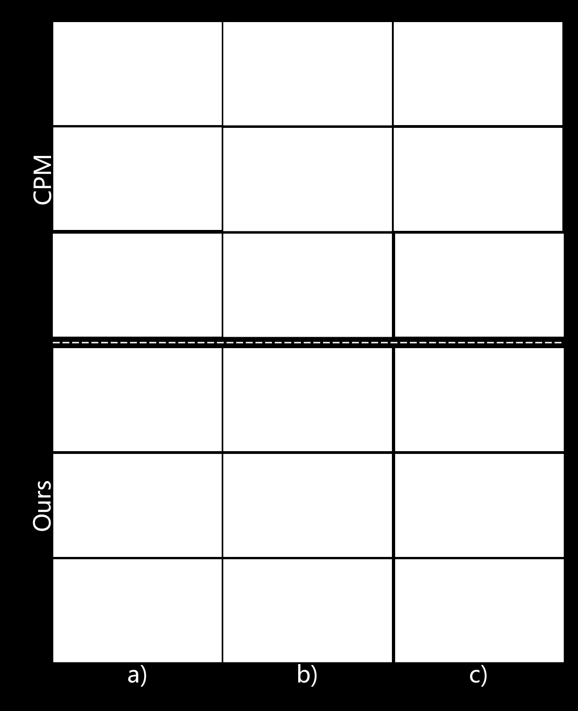
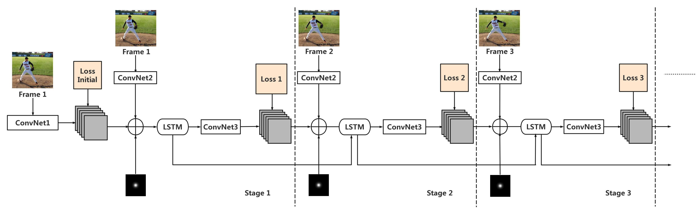
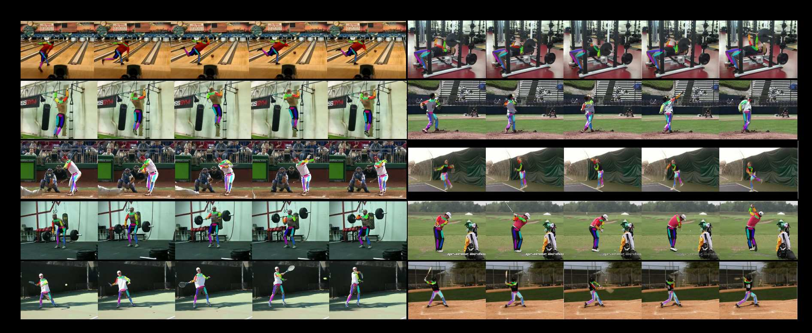
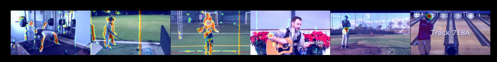
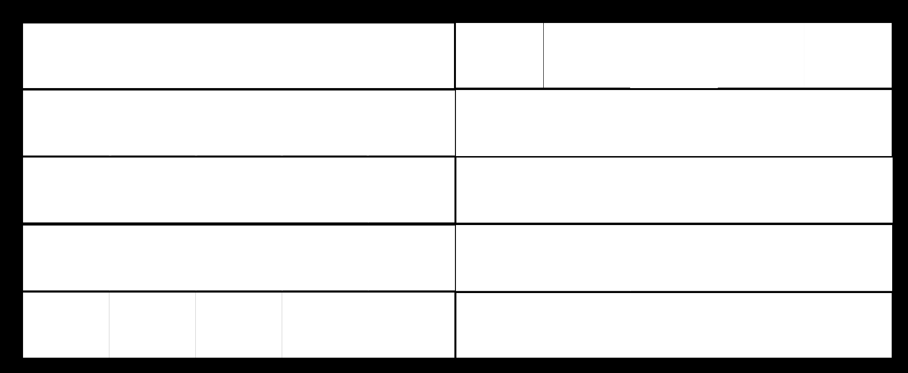
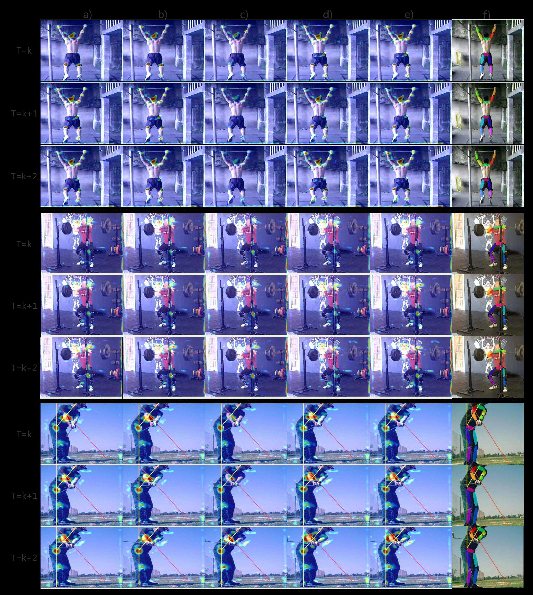
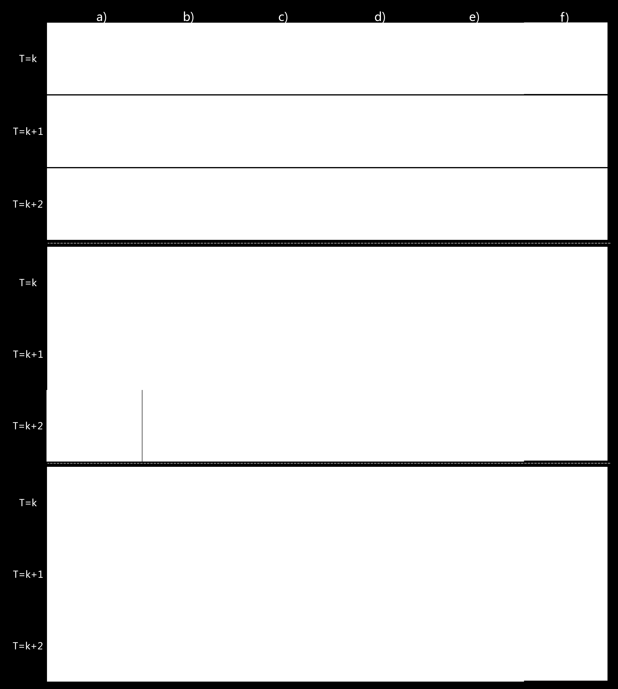

# LSTM Pose Machines（動画向け時間・空間統合型姿勢推定）
### LSTM Pose Machines

> [!NOTE]
> **💡 一言でいうと？**
> 動画の姿勢推定において、オクルージョン（隠れ）やモーションブラー（ブレ）で手足が吹っ飛ぶ「Jump問題」を、LSTMの記憶能力で根本から解決するネットワーク構造！

## 🚀 主な貢献と新規性

- 📌 **多段階CNNのRNN化と高速化**: 従来の重い画像向けモデルのステージ間で「重み共有」を行い、RNNとして再定義。これにより推論速度が従来の2倍以上に！
- 📌 **LSTMによる時間的な記憶（Memory）の獲得**: フレーム間にLSTMを導入し「過去の関節位置の記憶」を保持。手首が体に隠れて見えないフレームでも、過去の軌跡から正確な位置を推測し続けます。

---

## 💡 研究への応用・インサイト

> [!TIP]
> **🎯 MediaPipeのJump問題を根本解決するための「LSTM後処理」の導入**

### 1. LSTMベースの平滑化ネットワーク
MediaPipeから得られた時系列の3D座標をLSTM（または1D-CNN）に入力し、時間的整合性を加味した「滑らかな座標」に補正する軽量な後処理ネットワークを学習させることが、Jump問題の決定的な解決策になり得ます。

### 2. オクルージョン発生時の「記憶」の活用
`generate_joint_error_analysis.py` のような分析で、特定関節の座標が急激に跳ね上がるタイミング（＝オクルージョン発生時）を検知し、その区間だけ「LSTMが予測した過去の軌跡からの推論値」で置き換えるハイブリッドなアプローチが非常に強力です。

---

📄 全文翻訳（詳細）

# LSTM Pose Machines

## 著者情報
- **Yue Luo¹, Jimmy Ren¹, Zhouxia Wang¹, Wenxiu Sun¹, Jinshan Pan¹, Jianbo Liu¹, Jiahao Pang¹, Liang Lin¹˒²**
- ¹ SenseTime Research
- ² 中山大学 (Sun Yat-sen University, China)
- CVPR 2018 採択論文

---

## 概要

 (Abstract)
単一画像における人体姿勢推定（Human Pose Estimation）の最近の最先端結果は、多段階の畳み込みニューラルネットワーク（Multi-stage CNN）によって達成されています。

しかし、静止画像での優れたパフォーマンスにもかかわらず、これらのモデルを**ビデオ（動画）**に適用すると、計算量が膨大になるだけでなく、パフォーマンスの低下や**座標のちらつき（Flicking / Jittering）**が発生します。

このような最適とは言えない結果の主な原因は、「時系列的な幾何学的整合性（Sequential Geometric Consistency）」を強制できないこと、深刻な画質の劣化（例：モーションブラーやオクルージョン）に対処できないこと、そしてビデオフレーム間の時間的相関（Temporal Correlation）を捉えられないことにあります。

本論文では、これらの問題に取り組むための新しい**再帰型ネットワーク（Recurrent Network）**を提案します。
我々は、多段階CNNに対して「重み共有（Weight Sharing）」スキームを導入すれば、それを**再帰型ニューラルネットワーク（RNN）**として書き換えられることを示しました。

この性質により、複数のネットワークステージ間の関係が切り離され、ビデオに対してネットワークを呼び出す際の速度が大幅に向上します。
さらに、このアーキテクチャはビデオフレーム間に**Long Short-Term Memory (LSTM)** ユニットを採用することを可能にします。

この「メモリ拡張RNN（Memory-augmented RNN）」は、フレーム間の幾何学的整合性を強制するのに非常に効果的であることを発見しました。

また、ビデオにおける入力品質の低下（オクルージョン等）をうまく処理し、時系列の出力を安定化させることに成功しました。

実験の結果、我々のアプローチは2つの大規模なビデオ姿勢推定ベンチマークにおいて、既存の最先端手法を大幅に上回りました。

さらに、LSTM内部のメモリセルを探索し、このようなメカニズムがなぜビデオベースの姿勢推定に有益であるかについての洞察を提供します。

---

## 1. はじめに (Introduction)
これまでの姿勢推定モデルは「静止画像」で訓練されているため、ビデオに適用すると幾何学的整合性の欠如から明らかなエラーを引き起こしやすくなります。

例えば、深刻なオクルージョン（隠れ）や大きな動きによるモーションブラー（ブレ）によって、手足の位置が急激に飛ぶ（Jump）などの問題が起こります。

また、モデルが深く計算コストが高いため、リアルタイムアプリケーションへの展開には軽量なモデルが求められます。

理想的なモデルは、幾何学的な一貫性とビデオフレーム間の時間的依存関係（Temporal Dependency）の両方をモデル化できなければなりません。

従来はオプティカルフローを計算してフレーム間の動きを補正する手法がありましたが、フロー自体の計算も画質低下に弱く、計算コストが高いという欠点がありました。
本研究では、データ駆動型（Data-driven）のアプローチを採用し、フレーム間の時間的依存関係をLSTMで学習することで、高速かつ安定した姿勢推定を実現します。

---

## 2. LSTM Pose Machines のアーキテクチャ

### 2.1. 多段階CNNからRNNへの再定式化
従来のConvolutional Pose Machines (CPM) などの手法は、画像から特徴を抽出し、Stage 1, Stage 2... と複数のステージを直列に繋げてヒートマップを洗練（Refine）させていきます。
我々は、これら複数ステージのネットワークの**重みを共有（Weight Sharing）**させることで、空間的な多段階ネットワークを「時間的な再帰（RNN）」へと展開（Unroll）できることに着目しました。
これにより、パラメータ数が激減し、ビデオの各フレームを入力とする標準的なRNNモデルへとシームレスに変換されます。

### 2.2. LSTMによる時間的整合性のモデリング
単なるRNNではなく、時系列の長期的な依存関係を記憶できる**LSTM（Long Short-Term Memory）**を各ステージの間に配置します。
- **過去の記憶（Memory）**: 前のフレームで抽出された特徴と姿勢（ヒートマップ）の情報をメモリセルに保持します。
- **忘却と更新（Forget & Input Gates）**: オクルージョンが発生した場合、ネットワークは「現在の見えない画像特徴」よりも「過去から保持しているメモリ（例：直前まで手首があった位置）」を強く信頼するようにゲートを制御します。

これにより、数フレームの間手が隠れていても、正しい位置を推論し続けることができます。

---

## 3.

 分析とインサイト：なぜLSTMが機能するのか？

 (Analysis)

我々は、LSTM内部のメモリセルが具体的に何を学習しているのかを可視化して分析しました。
1. **暗黙的な動きモデリング**: メモリセルの出力ヒートマップを観察すると、関節の移動方向に対して「尾を引く（Trailing）」ような活性化パターンが見られました。

これは、オプティカルフローを明示的に与えなくても、LSTMが自発的に「関節の動きのベクトル（Motion Context）」を学習していることを示しています。
2. **オクルージョンへの耐性**: モーションブラーによって関節が一時的に消えたフレームにおいて、単一画像モデル（CPM等）は全く的外れな場所を予測してしまいます（Jumpの発生）。

しかし、LSTM Pose Machinesでは、メモリセルが直前の位置と動きベクトルを記憶しているため、見えないフレームでも正確な軌跡を補完（Interpolate）することができます。

---

## 4. 実験

と結果 (Experiments and Results)

- **データセット**: Penn Action Dataset および sub-JHMDB Dataset（動画姿勢推定の標準ベンチマーク）。
- **比較対象**: N-best法、オプティカルフローベースの平滑化手法（ChainedPredictions等）、空間ベースのCPMなど。

### 主要な実験結果：
1. **大幅な精度向上**:
   - Penn Actionデータセットにおいて、PCK（Percentage of Correct Keypoints）などの指標で既存の最先端手法を大きく上回りました。

特にオクルージョンが頻繁に発生する複雑なアクション（例：テニススイングやピッチング）において顕著な改善が見られました。
2. **高速な推論速度（Real-time Capability）**:
   - LSTMによる軽量な再帰構造を採用したことで、動画処理時の推論速度が従来の多段階CNNアプローチの**2倍以上高速化**されました。

これにより、リアルタイムでのビデオ姿勢推定システムへのデプロイが非常に現実的になりました。
3. **Flicking（ちらつき・Jump）の解消**:
   - 出力座標の平滑性を定量的に評価した結果、LSTM Pose Machinesはオプティカルフローを用いた高コストな後処理と同等以上の滑らかな軌跡を、単一のエンドツーエンド（End-to-End）ネットワークのみで出力できることが証明されました。

---

## 5. 結論 (Conclusion)
本論文では、ビデオにおける人体姿勢推定のために、幾何学的整合性と時間的依存関係を同時にモデル化する「LSTM Pose Machines」を提案しました。
多段階CNNの重み共有化とLSTMの導入により、モーションブラーやオクルージョンによる予測の不安定さ（Jump / Flicking）を根本から解決し、高精度かつ高速な推定を実現しました。

これは、時間的コンテキストを用いたデータ駆動型の姿勢平滑化の有用性を強く示すものです。

