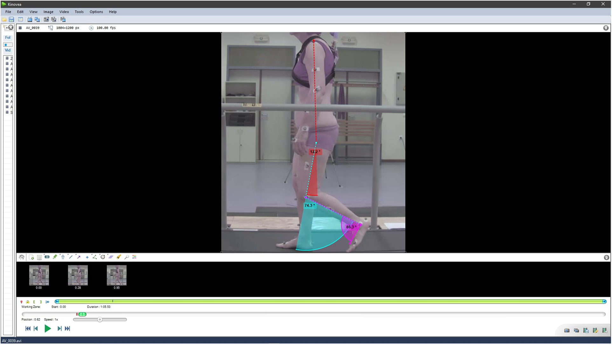
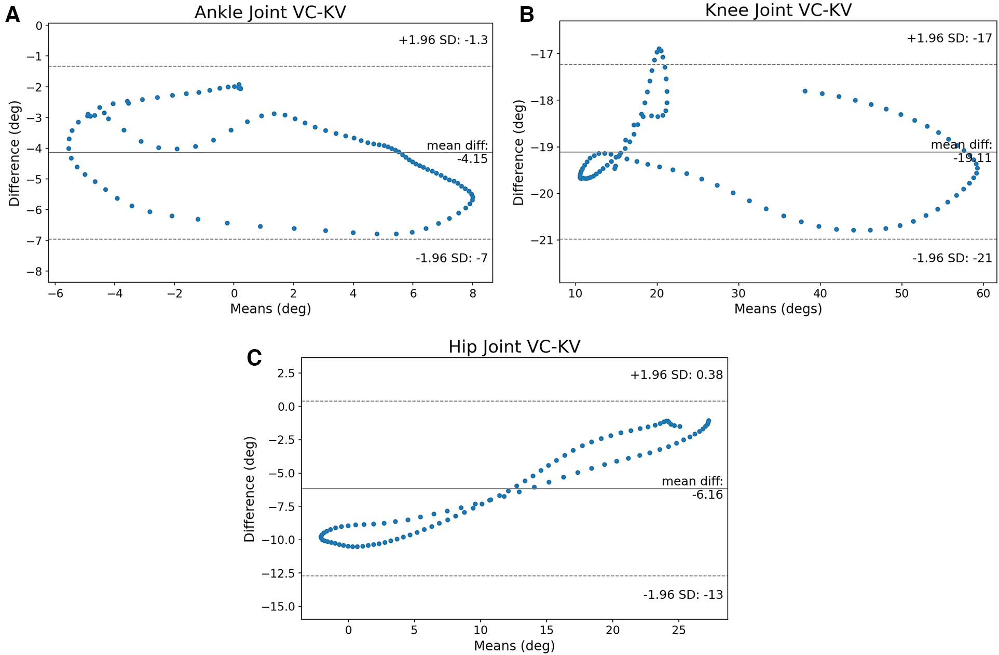

# 歩行分析における手動マーキング、2D姿勢推定、3Dマーカーシステムの比較
### Gait analysis comparison between manual marking, 2D pose estimation algorithms, and 3D marker-based system

> [!NOTE]
> **💡 一言でいうと？**
> 高齢者のトレッドミル歩行において、MediaPipeとOpenPoseをViconや手動アノテーション（Kinovea）と比較！全体的な動きの追跡は優秀だが、「足首」のような微小で重要な関節のトラッキングにはAIが苦戦することが判明。

## 🚀 主な貢献と新規性

- 📌 **高齢者の歩行への適用**: 特徴的な歩行パターンを持つ高齢者のトレッドミル歩行を対象に、MediaPipe (MP) と OpenPose (OP) の精度を臨床的に検証。
- 📌 **足首トラッキングの弱点発見**: AIを用いた姿勢推定は、全体的な動作の追跡にはマーカーベースと同等の性能を発揮するものの、足首などの「可動域が小さく、解剖学的なランドマークが分かりにくい関節」の誤認識に苦戦することを発見しました。

---

## 💡 研究への応用・インサイト

> [!TIP]
> **🎯 MediaPipeの「足首」エラーに対する戦略的対応**

### 1. 足首（Ankle）特有のOutlier検知の重要性
本論文で示された通り、MediaPipeは足首のトラッキングに弱点を持っています。田中様が `analyze_true_outliers.py` 等でエラー分析を行う際、**「足首」に関しては他の関節（膝や股関節）よりもJumpやOutlierが頻発する前提**で、足首専用の緩めの平滑化フィルタや、物理制約を強めにかけるアプローチが非常に効果的です。

### 2. 手動・AIハイブリッドアノテーションの提案
論文では、AIベースのツールのエラーをユーザーが手動で修正できるシステムの必要性が提唱されています。完全に自動化されたフィルタリングが難しい極端なJumpに対しては、外れ値が検出されたフレーム周辺のみ「手動修正（または補間）フラグ」を立てるインターフェースの構築が研究の次のステップになるかもしれません。

---

📄 全文翻訳（詳細）

## 1. 概要 (Abstract)
人工知能 (AI) とコンピュータビジョン (CV) の最近の進歩により、シンプルな2Dビデオを用いた自動姿勢推定アルゴリズムが誕生しました。本研究では、スプリットベルト・トレッドミル上での高齢者の歩行周期を調査しました。Openpose (OP) および Mediapipe (MP) アルゴリズムを、マーカーベースの3Dモーションキャプチャシステム (Vicon) およびバイオメカニクス用ビデオアノテーションツール (Kinovea) と比較しました。

## 2. 結果と結論
結果は、姿勢推定システムがマーカーベースのシステムに匹敵する動作トラッキングを実現できることを示しました。しかし、小さくても極めて重要な動きを示す関節（特に足首）の特定には苦戦することが明らかになりました。足首などの関節は、解剖学的ランドマークの誤認識（靴の影響など）に悩まされる可能性があります。手動ツールにはその問題はありませんが、測定者による静的なオフセットが生じます。結論として、専門家がエラーを手動修正できる「AI搭載ビデオアノテーションツール」が、低コストで姿勢推定の利点をもたらすと提案されています。

